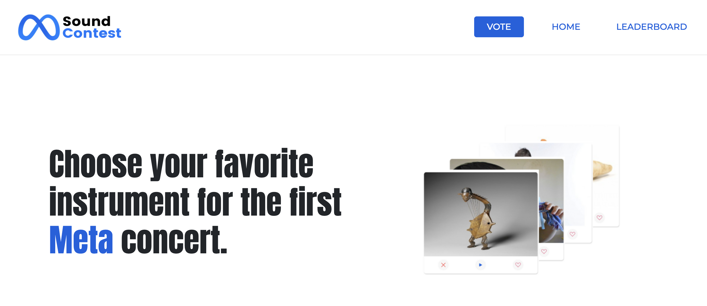

<div id="top"></div>

## MetaSoundContest

<!-- PROJECT LOGO -->
<br />
<div align="center">
  <a href="https://github.com/VianneyAccart/MetaSoundContest">
    
  </a>

  <p align="center">
    Description
    <br />
    <a href="https://github.com/VianneyAccart/MetaSoundContest"><strong>Explore the documentation</strong></a>
    <br />
    <br />
    <a href="https://meta-sound-contest.web.app/">Discover</a>
    ·
    <a href="https://github.com/VianneyAccart/MetaSoundContest/issues">Report Bug</a>
    ·
    <a href="https://github.com/VianneyAccart/MetaSoundContest/pulls">Request Feature</a>
  </p>
</div>

<!-- TABLE OF CONTENTS -->
<details>
  <summary>Table of Contents</summary>
  <ol>
    <li>
      <a href="#about-the-project">About The Project</a>
      <ul>
        <li><a href="#built-with">Built With</a></li>
      </ul>
    </li>
    <li>
      <a href="#getting-started">Getting Started</a>
      <ul>
        <li><a href="#prerequisites">Prerequisites</a></li>
        <li><a href="#installation">Installation</a></li>
      </ul>
    </li>
    <li><a href="#usage">Usage</a></li>
    <li><a href="#contact">Contact</a></li>
  </ol>
</details>

<!-- ABOUT THE PROJECT -->

## About The Project

[![Product Name Screen Shot][product-screenshot]](https://meta-sound-contest.web.app/)

<p align="right">(<a href="#top">back to top</a>)</p>

### Built With

- [Angular](https://angular.io/)
- [Bootstrap](https://getbootstrap.com)
- [Firebase Hosting and Firestore](https://firebase.google.com/)

<p align="right">(<a href="#top">back to top</a>)</p>

<!-- GETTING STARTED -->

## Getting Started

To get a local copy up and running follow these simple example steps.

### Prerequisites

- npm
  ```sh
  npm install npm@latest -g
  ```

### Installation

1. Clone the repo
   ```sh
   git clone https://github.com/VianneyAccart/MetaSoundContest.git
   ```
2. Install NPM packages
   ```sh
   npm install
   ```

<p align="right">(<a href="#top">back to top</a>)</p>

<!-- USAGE EXAMPLES -->

## Usage

MetaSoundContest is an application made in less 28 hours during an hackathon organised by Wild Code School. Theme was music and we wanted to create something new, original and a little bit funny !<br>
This application allows users to vote for the most original instrument, which will be used at the very first concert in the Metavers. For each instrument, user can listen the sound of the instrument, like or disklike, thanks to a Tinder like style.<br>
A leaderboard page allows to discover the most popular instrument, and leaderboard changes in real time thanks to Firebase database.<br>
Hope you'll enjoy this original project !<br>

<p align="right">(<a href="#top">back to top</a>)</p>

<!-- CONTACT -->

## Contact

Vianney ACCART - [LinkedIn](https://www.linkedin.com/in/vianneyaccart/) - vianneyaccart@gmail.com - [GitHub](https://github.com/VianneyAccart)<br>
Karim BOUDJEMAI - [LinkedIn](https://www.linkedin.com/in/karim-boudjemai-%F0%9F%96%A5-87490b221/) - karim.boudjemai.pro@gmail.com - [GitHub](https://github.com/Kariim42)<br>
Adam ROUX - [LinkedIn](https://www.linkedin.com/in/adamroux/) - roux.adam69@gmail.com - [GitHub](https://github.com/AdamRoux)<br>
Benjamin PREVEL - [LinkedIn](https://www.linkedin.com/in/benjamin-prevel-48125469/) - benjamin.prevel@gmail.com - [GitHub](https://github.com/BenPrevel)<br>

<p align="right">(<a href="#top">back to top</a>)</p>

<!-- MARKDOWN LINKS & IMAGES -->
<!-- https://www.markdownguide.org/basic-syntax/#reference-style-links -->

[product-screenshot]: src/assets/image/meta-sound-contest.png
